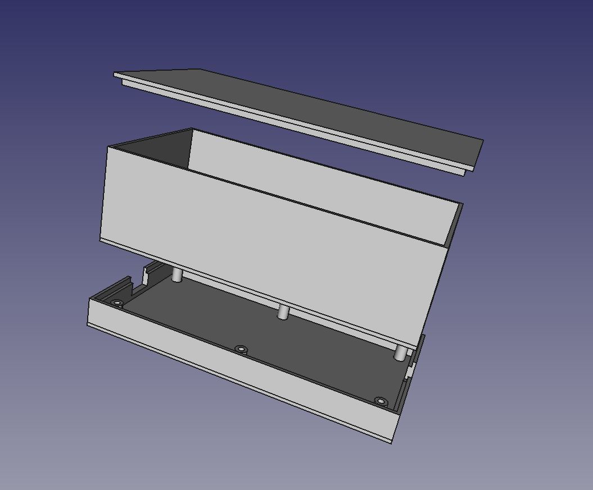
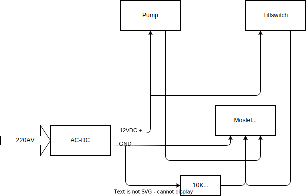
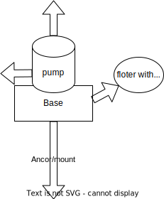

# Garden drain pump

What a strange thing to make, I could just buy one but whats the fun in that.

I have a 12V small pump, will just use that as the pump, do not need much power for the pump.

220V power, have 220VAC -> 12VDC converter, 400ma, should be plenty.

Some 12V to 3.3V I have so I can power a Wemos D1 for control.

Power mosfet to control on/off the pump.

Level measure device to turn on off the pump when needed.

Bonus, measure water flow, for fun, have flow meter.

Design:

220VAC -> 12VDC -> mosfet -> pump

12VDC -> 3.3VDC -> wmos d1 -> mosfet gate

## Part 1.
Make a box for the design.

Made a simple box to enclose the electronics.

While that prints...

## Part 2.

Control of pump.
First version could just have the pump always on.

mosfet could be controlled by a tilt switch so no esp32.

Trying the arduino mercury tilt switch KY-017 and a mosfet IRLB4132PBF
This config worked testing with a 12V lab supply.

Might be I will drop the mosfet and only use the mercury switch.

## Part 3.

Need to make a mounting for the pump and tilt switch.

