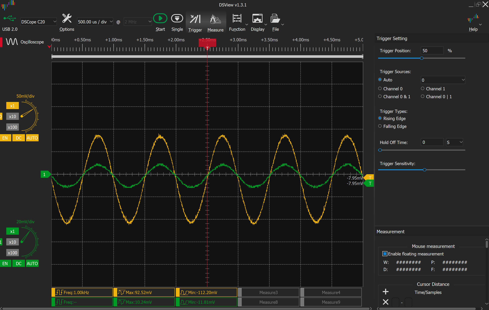
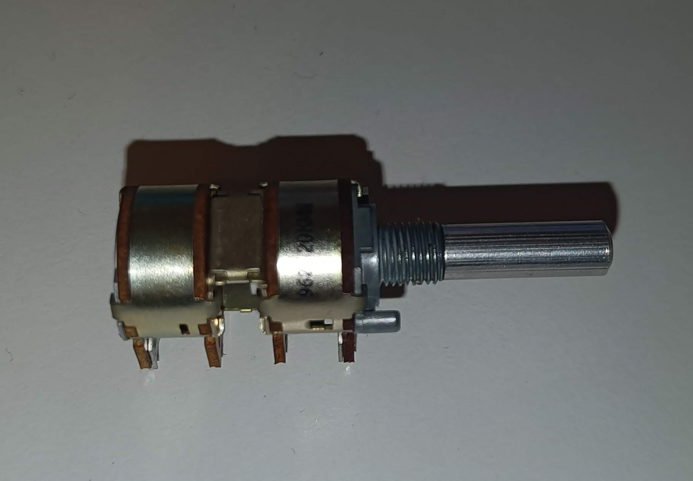
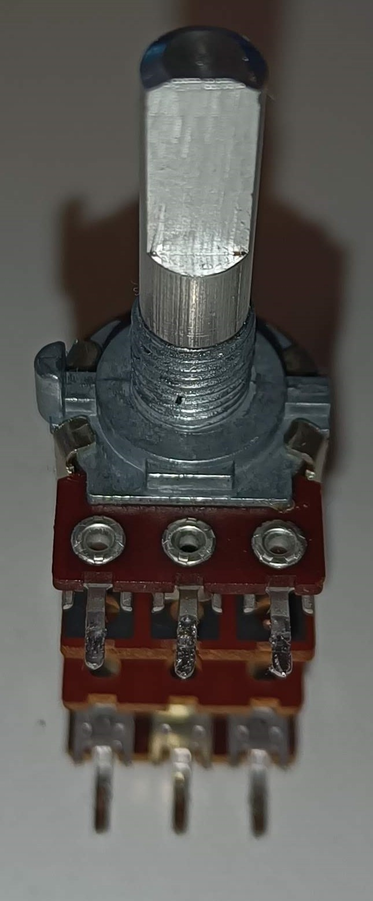

# Faulty NAD C160 One bad channel on the output, left channel seems bad.

## Debuging
1. setup to enable showing the fault.
    - Using [REW](https://www.roomeqwizard.com/) as a signal generator on a pc and connecting that to the preamp.
    - Using a oscilloscope, (I am using a USB version, DSCope C20) to measure the outputs PRE OUT 1.
    
       
    Bad Channel 1 in green

Need to open up and start looking inside.
Anything with the balance potmeter?

Have to take it apart to measure more on pots and caps, (caps looks to have leeked).
Big screws with embedded washer, side of cabinet.
short all around back plate.
long of the small in between the phono connectors.

short screws on front top, long on front bottom.

Mainboard has the short screws
Nut and washer on pots


Unsure about the balance potmeter, probably need to desolder to test it externally.

looks like the balance potmeter is something like this:
```
Manufacturer: ALPHA
Manufacturer Part No: RV16A01F-20-17K-MN20K-CC
```

Desolder potmeter and test it outside of circuit.
Potmeter looking at the knob has six feat, 3 in front close to the knob and 3 back behind the knob.
This looks like two separate potmeters inlined.



Potmeter testing center position
| Pin 1-2 | Pin 1-3 | Pin 2-3 |
| -- | -- | -- |
| 17.75kΩ | 17.76kΩ | 0kΩ  |

| Pin 4-5 | Pin 4-6 | Pin 5-6 |
| -- | -- | -- |
| 0kΩ | 17.63kΩ | 17.63kΩ  |
----
Potmeter testing left position
| Pin 1-2 | Pin 1-3 | Pin 2-3 |
| -- | -- | -- |
| 0kΩ | 17.77kΩ | 17.78kΩ  |

| Pin 4-5 | Pin 4-6 | Pin 5-6 |
| -- | -- | -- |
| 0.1kΩ | 17.65kΩ | 17.74kΩ  |
----
Potmeter testing right position
| Pin 1-2 | Pin 1-3 | Pin 2-3 |
| -- | -- | -- |
| 17.78kΩ | 17.78kΩ | 0kΩ  |

| Pin 4-5 | Pin 4-6 | Pin 5-6 |
| -- | -- | -- |
| 17.68kΩ | 17.63kΩ | 0.12kΩ  |
---
Potmeter testing left 90 deg position
| Pin 1-2 | Pin 1-3 | Pin 2-3 |
| -- | -- | -- |
| 7.310kΩ | 17.73kΩ | 10.73kΩ  |

| Pin 4-5 | Pin 4-6 | Pin 5-6 |
| -- | -- | -- |
| 0.56kΩ | 17.65kΩ | 18.23kΩ  |
----
Potmeter testing right ~90 deg position
| Pin 1-2 | Pin 1-3 | Pin 2-3 |
| -- | -- | -- |
| 17.80kΩ | 17.8kΩ | 0kΩ  |

| Pin 4-5 | Pin 4-6 | Pin 5-6 |
| -- | -- | -- |
| 11.13kΩ | 17.63kΩ | 7.65kΩ  |

Potmeter looks fine, not the culprit it seems.

### Voltages
Need to check voltages I think to see if they are correct.

Voltages to measure:
- +-59V (C714, C715)
- +-26V (C726, C727)
- +-18V (C745, C746)
- +12V (C734)
- +5.5V (C740)

Measurements
| +59V | -59V | +26V | -26V | +18V | -18V | +12V | +5.5V | 
| -- | -- | -- | -- | -- | -- | -- | -- |
| 53.1V | -54.0V | 26.3V | -26.4V | 18.2V | -18.2V | 12.2V | 5.7V |

Voltages looks ok, I guess expected as one channel works and one does not.

Check voltages closer to failing channel?

Will try to measure on the MD1C/B Modules

Removing cover under the amp gives access

Looking on the signal out on pin 6 on both M403 and M303 looks the same, so does not seem to be bad out of the line out module.

I had one oscilloscope probe on X10 on the probe, was it all for nothing? 
Now it seems good when measuring at least...

Seems to still be some bad signal on R channel when adjusting the balance, I think it was improved by just working with it, might fail again later.
Need to test in a system with actual sound not just test signals.
